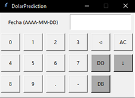

# PRIMER PROYECTO INDIVIDUAL DE HENRY - Python y Matemática

### Bienvenido a mi primer proyecto indivual de Henry para la carrera Data Science.

¡ Por favor lee TODO este material con atención !

## INTRODUCCION

- En este proyecto fue un desafío técnico donde evaluamos conceptos básicos sobre Python y machine learning.

- Se utilizo APIs de la página https://estadisticasbcra.com/ para obtener los datos históricos, tanto del dólar oficial como del dólar blue en Argentina.

